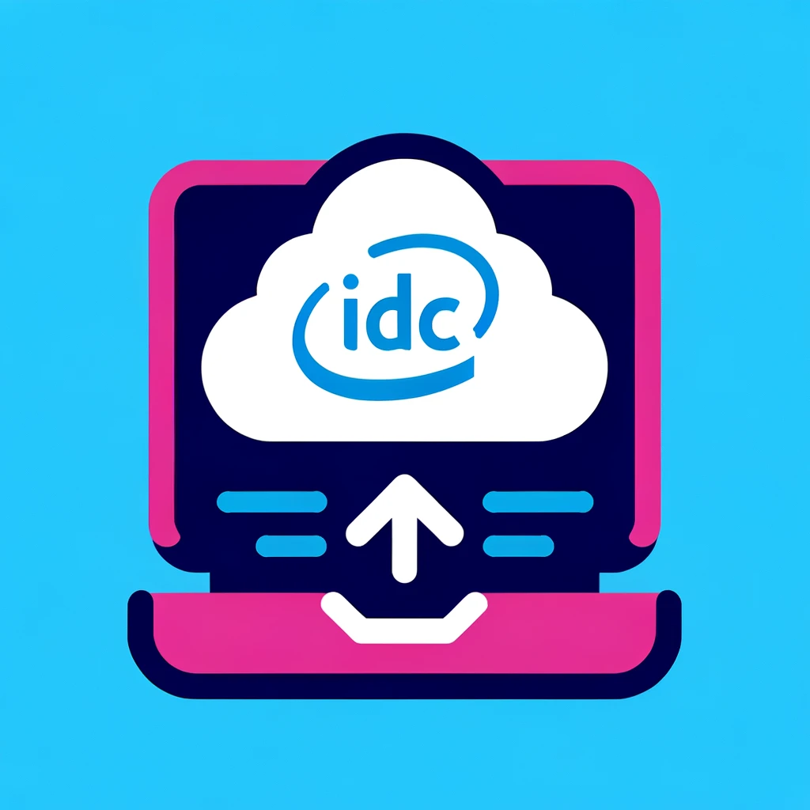

# [Unofficial]:IDC VSCode Extension

This extension enables developers to easily connect to Intel Developer Cloud (IDC) servers that come with preinstalled AI frameworks and access to Intel accelerators (XPUs). It integrates with Microsoft's VSCode Tunnel plugin to establish a secure SSH tunnel for development activities.

## Features

- Seamless SSH connection setup to IDC servers.
- Utilizes VSCode Tunnel plugin for secure connections.
- Persistent access with stored user credentials.

## Prerequisites

- An active account on Intel Developer Cloud.
- Your public SSH key added to your IDC profile.

## Getting Started

1. Install the extension from the VSCode Marketplace.
2. Retrieve your IDC username by initiating an SSH launch command from the IDC training notebooks section.
3. Enter your IDC username when prompted by the extension.
4. The extension stores your username for future sessions, eliminating the need for repeated setup.

## Usage

After installation and setup:

1. Run the `Connect to IDC` command from the VSCode command palette.
2. Authenticate with IDC when prompted.
3. Start your development session with the preinstalled AI frameworks and Intel accelerators.

## Contributing

Contributions to the IDC VSCode extension are welcome. Please feel free to fork the repository, make your changes, and submit a pull request.

## License

This project is licensed under the MIT License - see the LICENSE file for details.

## Acknowledgments

- Intel Developer Cloud for providing the cloud infrastructure.
- Microsoft for the VSCode Tunnel plugin.

## Support

For support, please open an issue in the GitHub repository.
